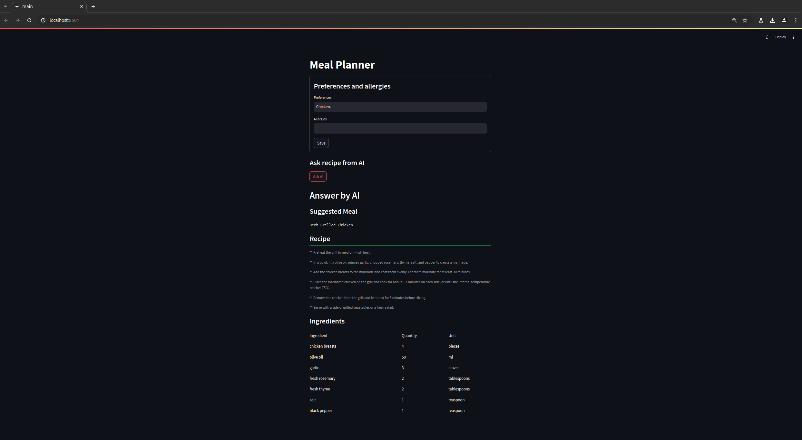
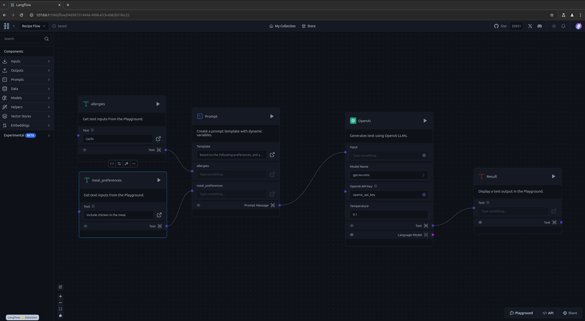

# meal-planner
A Python-based webapp to generate recipes based on preferences and allergies using AI.



This project is build using:
- Python
    - Streamlit library for the frontend
- Langflow to handle AI Agent flow - [see more on Github](https://github.com/langflow-ai/langflow)
- OpenAI gpt-4o-mini to generate the recipe

## Setup
### Prerequisites
- Ensure following requirements are met:

```
Python 3.10 or greater
Access and credits to use OpenAI API
```

- Install dependencies by running:
```
pip install -r requirements.txt
```

- Setup .env file with your OpenAI API key, see .env.template -file.

## Running the application
- To run the web application:
```
streamlit run main.py
```
- Open browser
```
http://localhost:8501
```

## Developing the application
- Frontend development with streamlit: Development was done using VSCode and the main logic can be found from main.py
- Langflow AI flow development
    - Development was done in the local environment
    - To start the Langlow app, run:
    ```
    python -m langflow run
    ```
    - With your browser, navigate to:
    ```
    http://127.0.0.1:7860
    ```
    - Create a new project
    - Import the flow from the JSON-file ```langflow_recipe_flow.json```
    - Store your OpenAI API as an global variable
        - Go to Settings
        - Click Add New
        - Type in to "Variable Name" -> "openai_api_key"
        - Select "Type" as "Credential"
        - Type your OpenAI API key to "Value"
    - Flow can be tested and developed in the GUI
    - When you are ready with your development, export the flow and replace the original file in the root of the project ```langflow_recipe_flow.json``` with the updated one
- Langflow flow is relative simple as you can see from the picture below

- Flow builds the prompt using two input variables from the user: preferences and allergies.
- You can check the promt from ```prompt.txt```

### Disclaimer
This is an educational project to test and demo new tools and technologies.